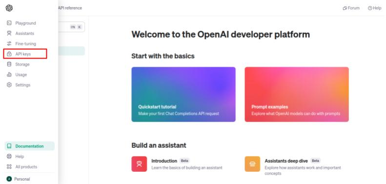

In the academic environment, time is a particularly valuable resource for researchers.
During my doctoral studies, in some occasions, I would read through an entire scientific paper only to find out that the information it contained was not specially useful for my research.

This project tackles this problem by employing a large language model (OpenAI's GPT-3.5) to summarize scientific papers in PDF format and produce an MP3 audio file so that the main ideas of the paper can be conveniently listened to (e.g. during commute to work, a workout session or even while cleaning the house).
Furthermore, the developed tool can be useful for visually impaired individuals, aiding with inclusion in the scientific community.

Details of the implementation in a python script are given below.
The GitHub repository for this project can be accessed in [this link](https://github.com/allanpayeras/portfolio/tree/main/summarize_pdf).
In this page, you will also find information about usage of the script as well as instructions for installing its dependencies.

As an example, the audio summary of the paper *AugerPrime implementation in the Offline simulation and reconstruction framework*, by David Schmidt for the Pierre Auger Collaboration ([link](/portfolio/audio_summaries/assets/2017_ICRC_schmidt.pdf)), is provided below.

<div class="audio-player">
  <audio controls>
    <source src="/portfolio/audio_summaries/assets/summary_2017_ICRC_schmidt.mp3" type="audio/mpeg">
    Your browser does not support the audio element.
  </audio>
</div>

<script src="/assets/js/app.js"></script>


## Implementation details

To reach our goal of summarizing academic papers a sequence of steps were implemented in a python script.
The implementation heavily relies on the [LangChain](https://python.langchain.com/docs/get_started/introduction) framework, which provides useful modules to effectively interact with large language models (LLMs).

Initially, the provided PDF file is parsed using the [PyPDFLoader](https://python.langchain.com/docs/modules/data_connection/document_loaders/pdf) class, based on the [PyPDF](https://pypdf.readthedocs.io/en/stable/) package, included in LangChain.
All the text in the PDF file is combined into a single string.
Subsequently, the entire text is divided into chunks of a maximum of 12,000 characters each.
While some papers will fit in the context window of the LLM, most of them are larger.
The splitting step ensures that the text chunks will fit the context window of the LLM.

Utilizing LangChain, a chain was created for the summarization of individual text chunks.
The chain includes a prompt template that receives the text to be summarized and is subsequently fed to the LLM.
The model employed for this task is [GPT-3.5-turbo-0125](https://platform.openai.com/docs/models/gpt-3-5-turbo) from OpenAI which has a context window of 16,385 tokens.
A temperature setting of 0.2 was applied.
This low value produces more deterministic outputs that are truthful to the original text provided.
This is particularly important when summarizing individual chunks, where disconnection from the context of the rest of the text could produce hallucinations in the output if a higher temperature value is employed.

With the created chain, LangChain conveniently allow us to summarize each text chunk (individually) in parallel.
The outputs of each individual summarization are merged to produce a final summary text.

When experimenting with the character size of the text chunk in the splitting step, I verified that it significantly impacts on the final summary.
Larger chunk sizes result in less detailed summaries, as expected.
From the point of view of scientific research, having enough relevant details in the summary is valuable (otherwise the researcher could just read the abstract of the paper to know what it is about).
Therefore, I found that a size of 12,000 characters seems to produce a fair balance between summarization power and detail retention.
This point could be further explored as discussed in the following section.

In the final step, we utilized the [Google text-to-speech API](https://pypi.org/project/gTTS/) to effortlessly convert the summary text into an audio MP3 file.


## Future improvements

Although our implementation offers a working program that accomplishes its objective, some aspects of this project can be improved to provide enhanced results.

* Improve the quality of the text extraction from the PDF file using a tool better suited for academic papers, such as [NOUGAT (Neural Optical Understanding for Academic Documents)](https://github.com/facebookresearch/nougat/tree/main).
This option offers the opportunity to enhance the splitting step, focusing on the different sections of the paper and ultimately leading to better context when summarizing the different chunks.
This tool, however, requires a GPU for practical performance, for this reason we chose the simpler `pypdf` package for now.

* Implement options for the user to control the duration of the produced audio summary.
This level of customization would intrinsically be related to the size of the text chunks in the splitting step.
Moreover, it would potentially require new summarization strategies including experimentation with prompt engineering.

* The LLM could be fine-tuned for summarization of academic papers.
This approach has the potential of increasing the quality of the summaries, and providing results more aligned with the needs of the academic community.

* The quality of the audio file can be enhanced using a more sophisticated text-to-speech (TTS) tool.
A test was performed utilizing the OpenAI TTS model, yielding great results, as presented below.
However, it substantially increases the cost.
Other models (from Hugging Face) could be employed.

<div class="audio-player">
  <audio controls>
    <source src="/portfolio/audio_summaries/assets/test_openai_tts_david.mp3" type="audio/mpeg">
    Your browser does not support the audio element.
  </audio>
</div>

* Provide a graphical user interface to enhance the user experience with the program.
The user can conveniently upload the article PDF file as well as easily provide an authentication key and subsequently retrieve the resulting audio file.
A prominent option would be the implementation with [Streamlit](https://streamlit.io/).


## Prerequisites

Some packages must be installed for the python script to work properly.

The program heavily relies on the LangChain framework, however some dependencies must be installed separately such as the `pypdf` and `langchain-openai`.
The `python-dotenv` package is necessary for loading the authentication key for the OpenAI API.
Lastly, we will need the Google text-to-speech API.

Using `pip`, the command below should correctly install the dependencies for the script. 
```
pip install python-dotenv pypdf langchain langchain-openai gTTS
```
In some cases, `pip3` should be used instead of `pip`.
In case of trouble, please refer to the documentation of the corresponding packages.

Moreover, an authentication key for utilizing the OpenAI API is necessary.
One can be generated in the OpenAI API [website](https://openai.com/blog/openai-api).
After logging into your account (or signing up for an account), go to "API keys" (as shown in the image below) to generate a new key.



Note that the utilization of the OpenAI API is not free. However, prices are very low. Summarizing academic papers only costs a few cents. More information about pricing can be found [here](https://openai.com/pricing).

For the script to work properly, a `.env` file should be created in the same directory.
Insert the generated key in the file as shown below
```
OPENAI_API_KEY=<your_key>
```
Remember to keep your personal key safe and never share it with anyone.


## Usage

Clone the repository to your local machine with
```
git clone git@github.com:allanpayeras/portfolio.git
```
Then change directory to the `summarize_pdf` directory.

To summarize a paper and generate the audio file run the command
```
python3 summarize.py path/to/pdf
```
where `path/to/pdf` is the location of the PDF file.
The script will produce an MP3 file with the name `summary.mp3` in the current working directory.
The default name of the audio file can be overridden with the option `-o`, however do not include the file extension in the provided name.